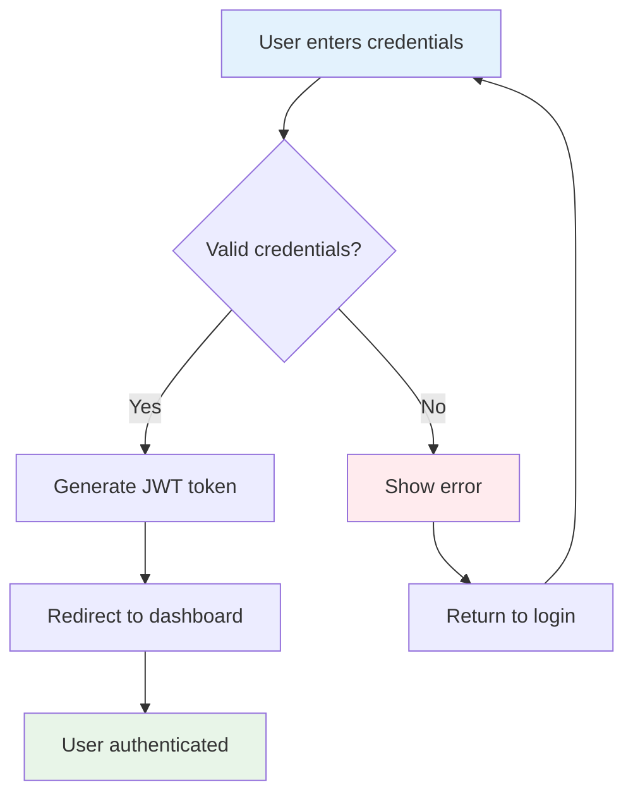
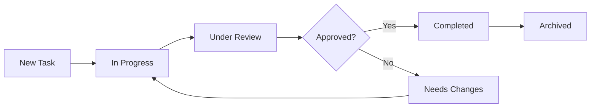
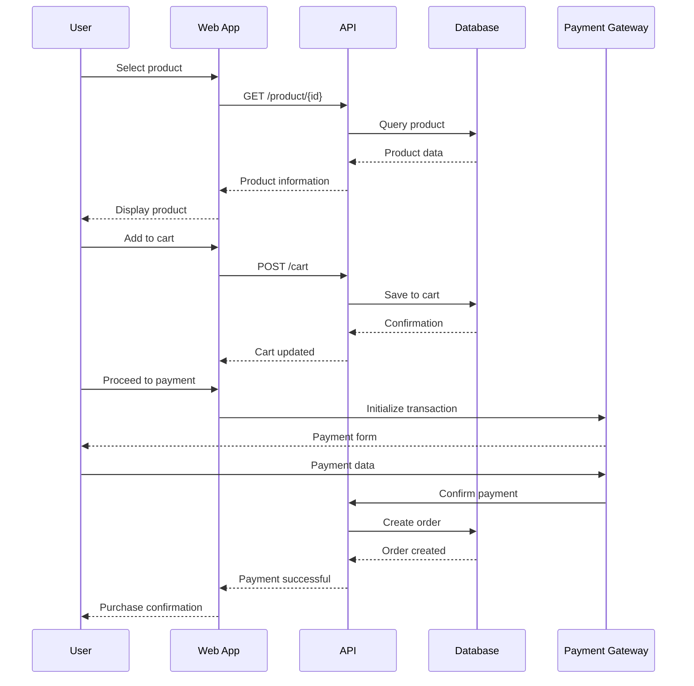
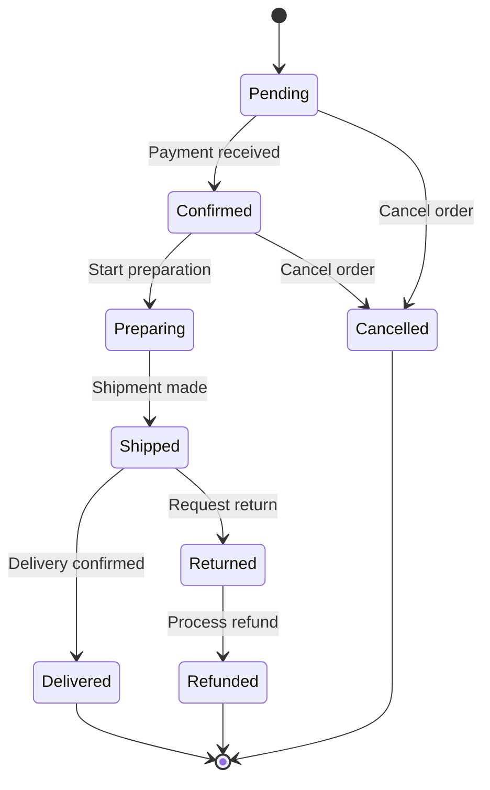
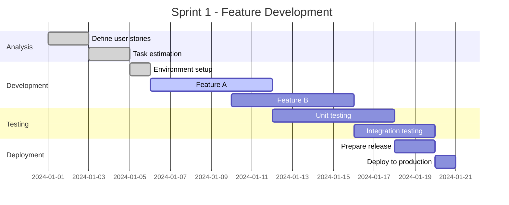

# Mermaid Diagram Examples

This guide presents practical examples of different types of diagrams you can create using Mermaid.

## Flowcharts

### Example 1: Login Process

````markdown

````

**Result:**


### Example 2: Task Lifecycle

````markdown

````

**Result:**


## Sequence Diagrams

### Example 3: Online Purchase Process

````markdown

````

**Result:**


## Class Diagrams

### Example 4: Blog System

````markdown
```mermaid
classDiagram
    class User {
        -id: number
        -name: string
        -email: string
        +login()
        +logout()
        +createPost()
    }
    
    class Post {
        -id: number
        -title: string
        -content: string
        -createdAt: Date
        +publish()
        +edit()
        +delete()
    }
    
    class Comment {
        -id: number
        -text: string
        -date: Date
        +create()
        +edit()
        +delete()
    }
    
    class Category {
        -id: number
        -name: string
        -description: string
        +add()
        +remove()
    }
    
    User ||--o{ Post : writes
    Post ||--o{ Comment : has
    User ||--o{ Comment : makes
    Post }o--|| Category : belongs to
```
````

**Result:**
```mermaid
classDiagram
    class User {
        -id: number
        -name: string
        -email: string
        +login()
        +logout()
        +createPost()
    }
    
    class Post {
        -id: number
        -title: string
        -content: string
        -createdAt: Date
        +publish()
        +edit()
        +delete()
    }
    
    class Comment {
        -id: number
        -text: string
        -date: Date
        +create()
        +edit()
        +delete()
    }
    
    class Category {
        -id: number
        -name: string
        -description: string
        +add()
        +remove()
    }
    
    User ||--o{ Post : writes
    Post ||--o{ Comment : has
    User ||--o{ Comment : makes
    Post }o--|| Category : belongs to
```

## State Diagrams

### Example 5: Order States

````markdown

````

**Result:**


## Gantt Charts

### Example 6: Sprint Planning

````markdown

````

**Result:**


## Useful Tips

### Style Customization

You can customize colors and styles of your diagrams:

````markdown
```mermaid
flowchart TD
    A[Start] --> B[Process]
    B --> C[End]
    
    classDef start fill:#e1f5fe,stroke:#0277bd,stroke-width:3px
    classDef process fill:#fff3e0,stroke:#f57c00,stroke-width:2px
    classDef end fill:#e8f5e8,stroke:#388e3c,stroke-width:2px
    
    class A start
    class B process
    class C end
```
````

**Result:**
```mermaid
flowchart TD
    A[Start] --> B[Process]
    B --> C[End]
    
    classDef start fill:#e1f5fe,stroke:#0277bd,stroke-width:3px
    classDef process fill:#fff3e0,stroke:#f57c00,stroke-width:2px
    classDef end fill:#e8f5e8,stroke:#388e3c,stroke-width:2px
    
    class A start
    class B process
    class C end
```

### Best Practices

1. **Simplicity**: Keep diagrams simple and easy to understand
2. **Consistency**: Use a consistent color scheme
3. **Clear labels**: Use descriptive names
4. **Documentation**: Include explanations when necessary

## Additional Resources

- [Official Mermaid Documentation](https://mermaid.js.org/)
- [Live Editor](https://mermaid.live/)
- [More Examples](https://mermaid.js.org/syntax/examples.html)

Experiment with these examples and create your own diagrams!