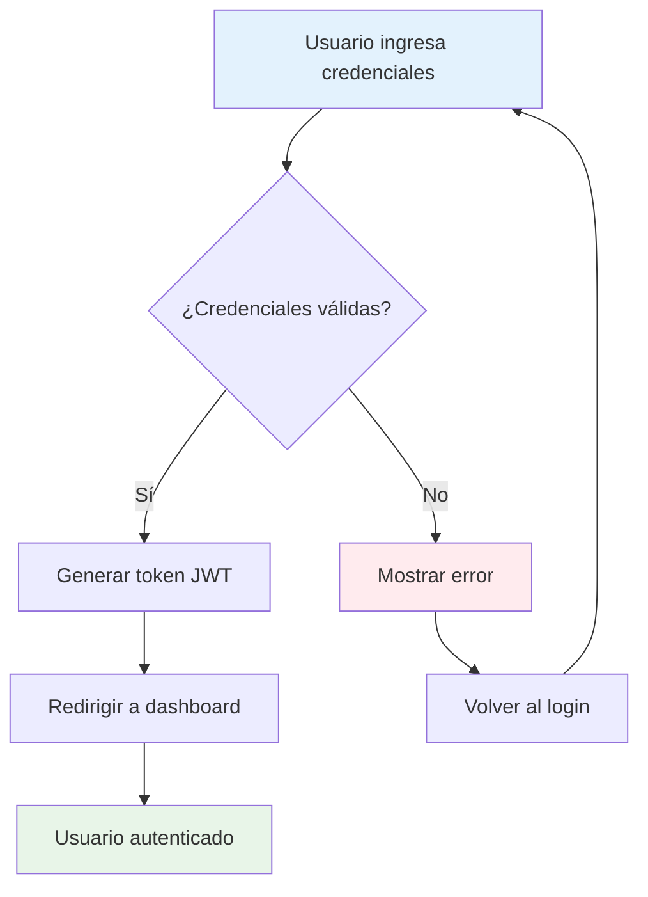
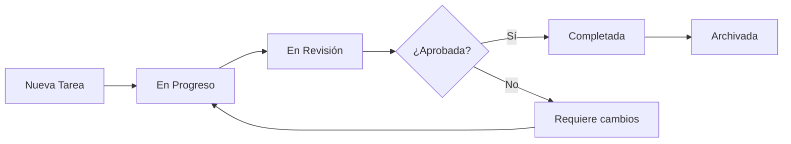
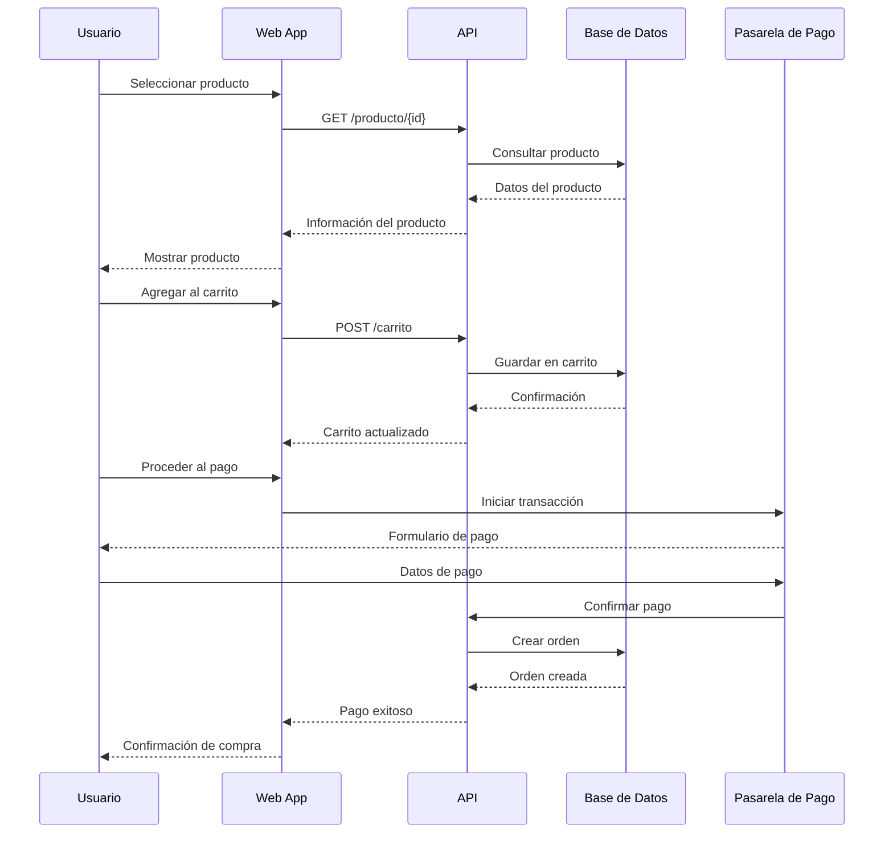
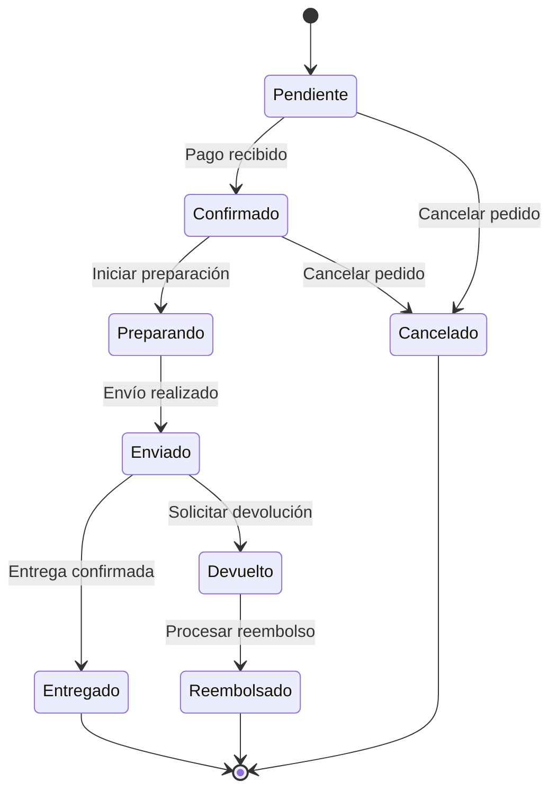
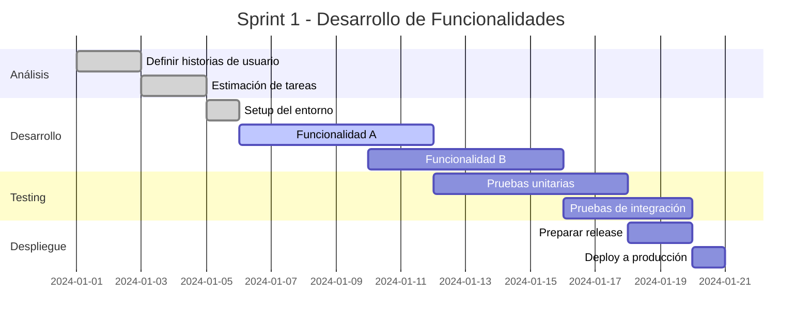
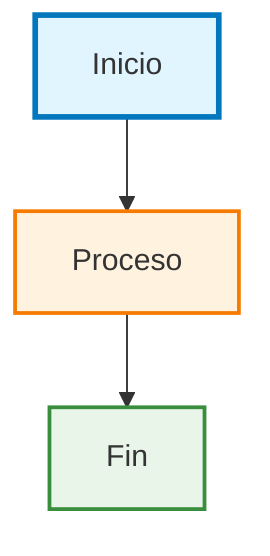

# Ejemplos de Diagramas Mermaid

Esta guía presenta ejemplos prácticos de diferentes tipos de diagramas que puedes crear usando Mermaid.

## Diagramas de Flujo

### Ejemplo 1: Proceso de Login

````markdown

````

**Resultado:**


### Ejemplo 2: Ciclo de Vida de una Tarea

````markdown

````

**Resultado:**


## Diagramas de Secuencia

### Ejemplo 3: Proceso de Compra Online

````markdown

````

**Resultado:**


## Diagramas de Clases

### Ejemplo 4: Sistema de Blog

````markdown
```mermaid
classDiagram
    class Usuario {
        -id: number
        -nombre: string
        -email: string
        +login()
        +logout()
        +crearPost()
    }
    
    class Post {
        -id: number
        -titulo: string
        -contenido: string
        -fechaCreacion: Date
        +publicar()
        +editar()
        +eliminar()
    }
    
    class Comentario {
        -id: number
        -texto: string
        -fecha: Date
        +crear()
        +editar()
        +eliminar()
    }
    
    class Categoria {
        -id: number
        -nombre: string
        -descripcion: string
        +agregar()
        +eliminar()
    }
    
    Usuario ||--o{ Post : escribe
    Post ||--o{ Comentario : tiene
    Usuario ||--o{ Comentario : hace
    Post }o--|| Categoria : pertenece
```
````

**Resultado:**
```mermaid
classDiagram
    class Usuario {
        -id: number
        -nombre: string
        -email: string
        +login()
        +logout()
        +crearPost()
    }
    
    class Post {
        -id: number
        -titulo: string
        -contenido: string
        -fechaCreacion: Date
        +publicar()
        +editar()
        +eliminar()
    }
    
    class Comentario {
        -id: number
        -texto: string
        -fecha: Date
        +crear()
        +editar()
        +eliminar()
    }
    
    class Categoria {
        -id: number
        -nombre: string
        -descripcion: string
        +agregar()
        +eliminar()
    }
    
    Usuario ||--o{ Post : escribe
    Post ||--o{ Comentario : tiene
    Usuario ||--o{ Comentario : hace
    Post }o--|| Categoria : pertenece
```

## Diagramas de Estado

### Ejemplo 5: Estados de un Pedido

````markdown

````

**Resultado:**


## Diagramas de Gantt

### Ejemplo 6: Planificación de Sprint

````markdown

````

**Resultado:**


## Consejos Útiles

### Personalización de Estilos

Puedes personalizar los colores y estilos de tus diagramas:

````markdown

````

**Resultado:**


### Mejores Prácticas

1. **Simplicidad**: Mantén los diagramas simples y fáciles de entender
2. **Consistencia**: Usa un esquema de colores consistente
3. **Etiquetas claras**: Utiliza nombres descriptivos
4. **Documentación**: Incluye explicaciones cuando sea necesario

## Recursos Adicionales

- [Documentación oficial de Mermaid](https://mermaid.js.org/)
- [Editor en línea](https://mermaid.live/)
- [Más ejemplos](https://mermaid.js.org/syntax/examples.html)

¡Experimenta con estos ejemplos y crea tus propios diagramas!