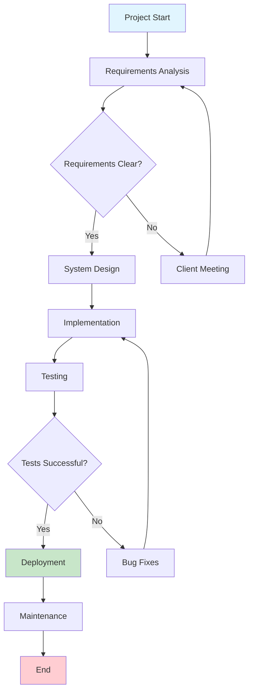
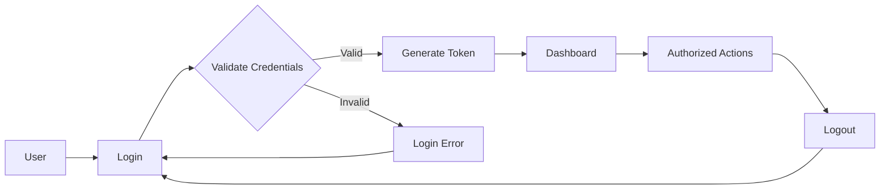
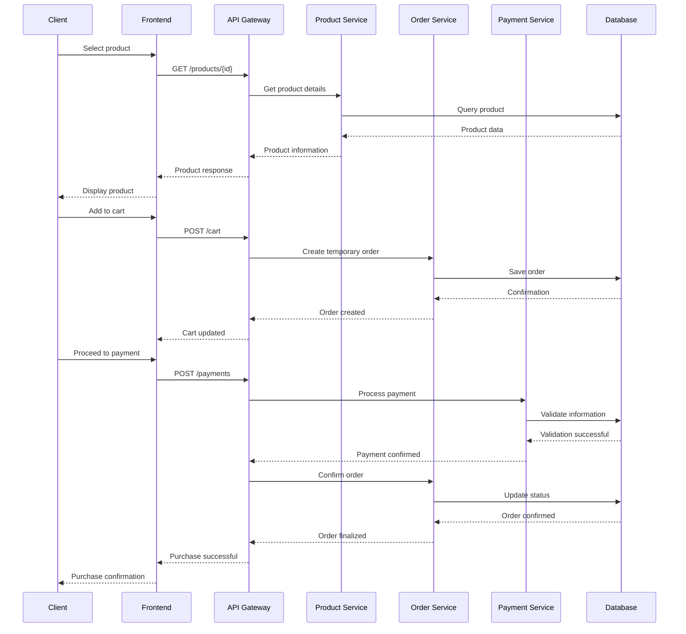
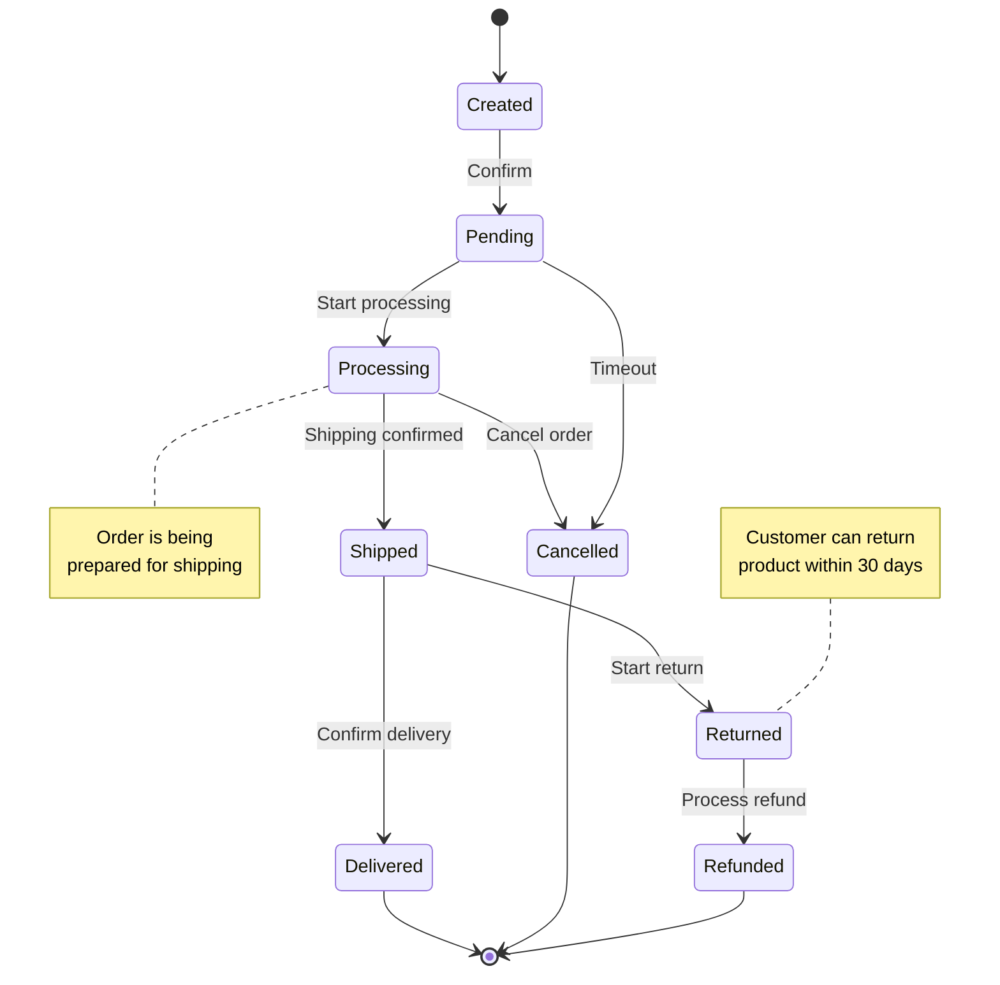
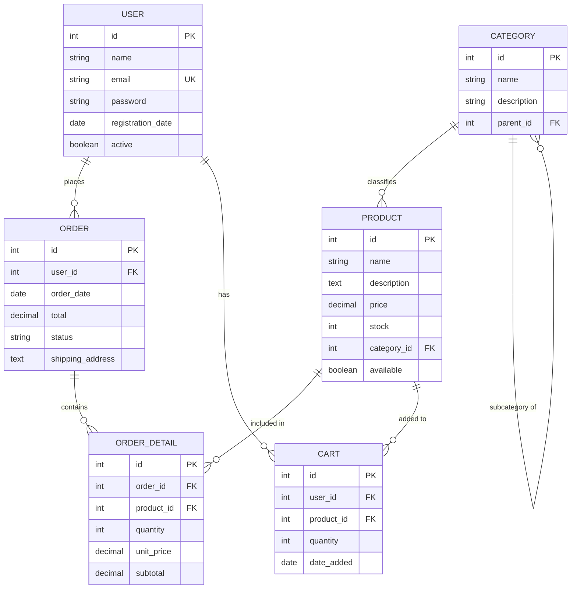
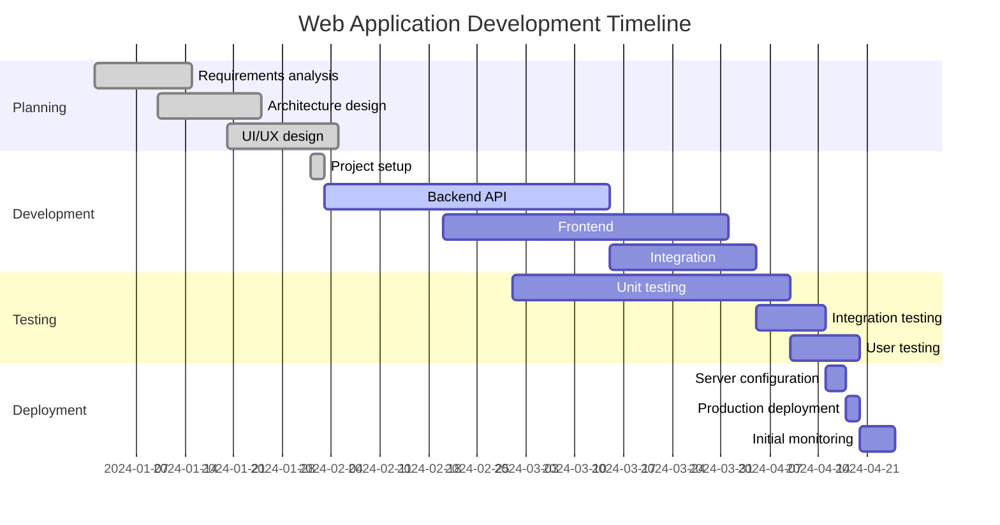
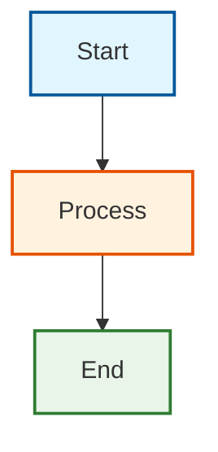

# Complete Mermaid Diagram Examples

This guide presents detailed examples of different types of diagrams you can create using the Mermaid component.

## Flowcharts

### Example 1: Software Development Process

````markdown

````

**Result:**


### Example 2: Authentication System

````markdown

````

**Result:**


## Sequence Diagrams

### Example 3: REST API - Purchase Process

````markdown

````

**Result:**


## Class Diagrams

### Example 4: Library Management System

````markdown
```mermaid
classDiagram
    class User {
        -id: String
        -name: String
        -email: String
        -registrationDate: Date
        +login()
        +logout()
        +searchBook()
    }
    
    class Book {
        -isbn: String
        -title: String
        -author: String
        -publicationDate: Date
        -available: Boolean
        +lend()
        +return()
        +getInfo()
    }
    
    class Loan {
        -id: String
        -loanDate: Date
        -returnDate: Date
        -status: String
        +create()
        +finalize()
        +extend()
    }
    
    class Library {
        -name: String
        -address: String
        +addBook()
        +removeBook()
        +searchBook()
        +generateReport()
    }
    
    User ||--o{ Loan : makes
    Book ||--o{ Loan : includes
    Library ||--o{ Book : contains
    Library ||--o{ User : registers
```
````

**Result:**
```mermaid
classDiagram
    class User {
        -id: String
        -name: String
        -email: String
        -registrationDate: Date
        +login()
        +logout()
        +searchBook()
    }
    
    class Book {
        -isbn: String
        -title: String
        -author: String
        -publicationDate: Date
        -available: Boolean
        +lend()
        +return()
        +getInfo()
    }
    
    class Loan {
        -id: String
        -loanDate: Date
        -returnDate: Date
        -status: String
        +create()
        +finalize()
        +extend()
    }
    
    class Library {
        -name: String
        -address: String
        +addBook()
        +removeBook()
        +searchBook()
        +generateReport()
    }
    
    User ||--o{ Loan : makes
    Book ||--o{ Loan : includes
    Library ||--o{ Book : contains
    Library ||--o{ User : registers
```

## State Diagrams

### Example 5: Purchase Order States

````markdown

````

**Result:**


## Entity Relationship Diagrams

### Example 6: E-commerce Database

````markdown

````

**Result:**


## Gantt Charts

### Example 7: Project Timeline

````markdown

````

**Result:**


## Tips for Using Mermaid

### Best Practices

1. **Keep it simple**: Don't overload diagrams with too much information
2. **Use consistent colors**: Define a color scheme and stick to it
3. **Clear labels**: Use descriptive names for nodes and relationships
4. **Documentation**: Always include a brief explanation of the diagram

### Customization with Styles

You can customize the appearance of your diagrams:

````markdown

````

**Result:**


## Additional Resources

- [Official Mermaid Documentation](https://mermaid.js.org/)
- [Mermaid Live Editor](https://mermaid.live/)
- [Example Gallery](https://mermaid.js.org/syntax/examples.html)

Experiment with different diagram types to find the one that best fits your documentation needs!