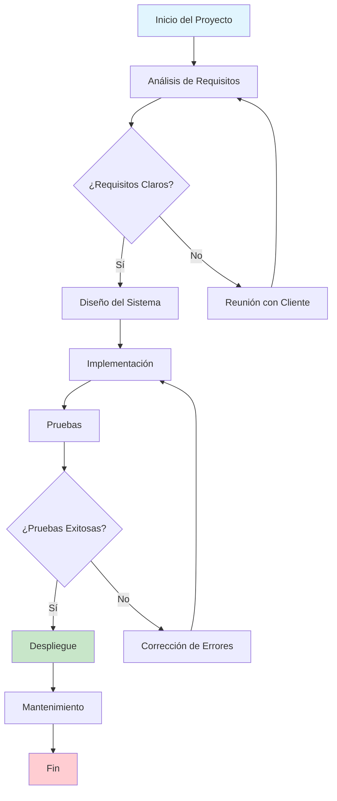
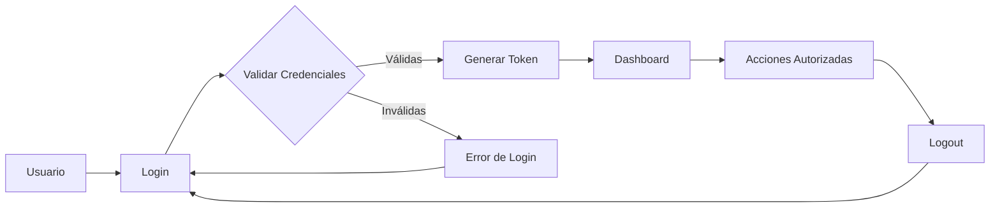
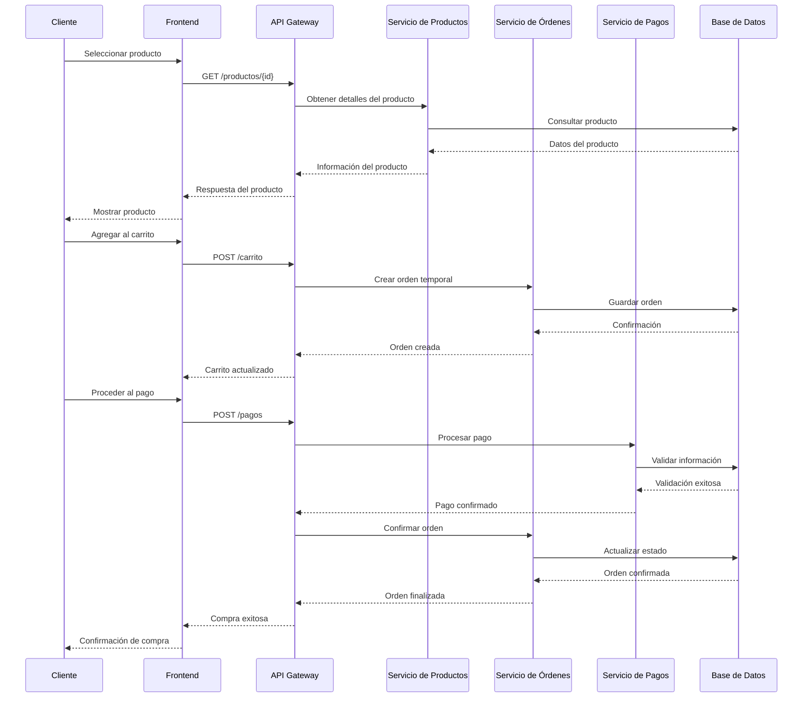
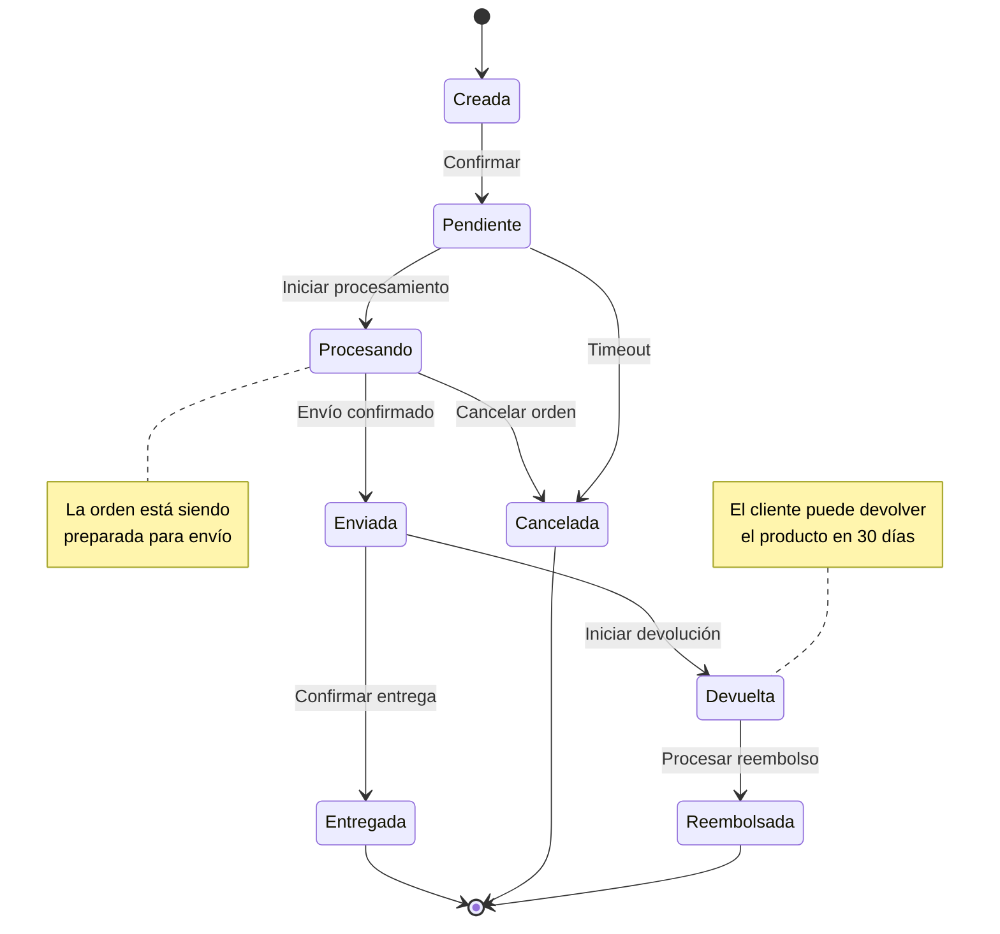
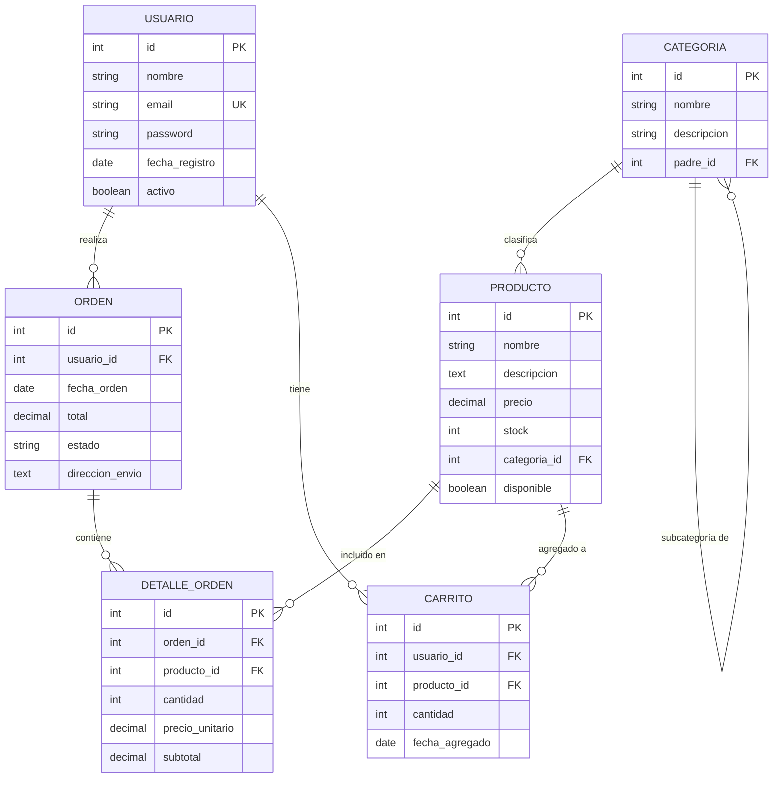
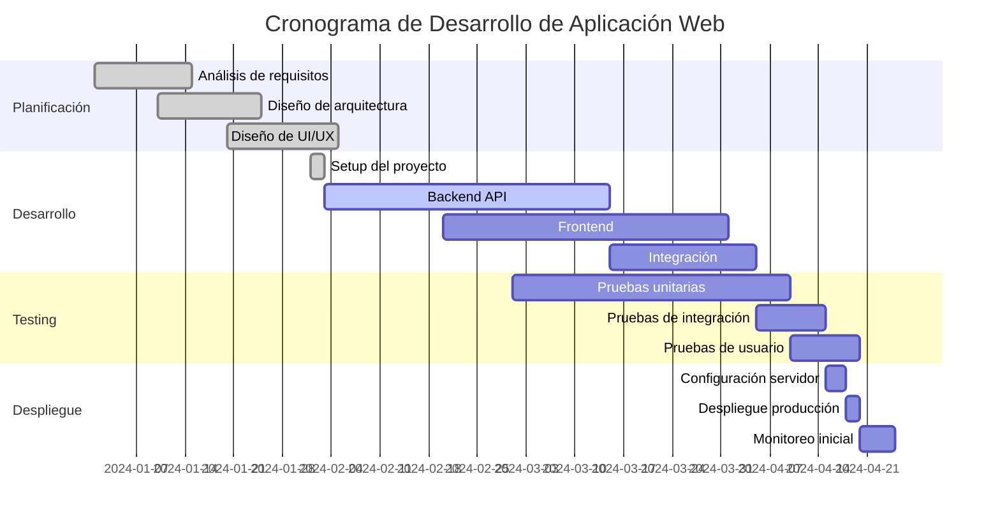
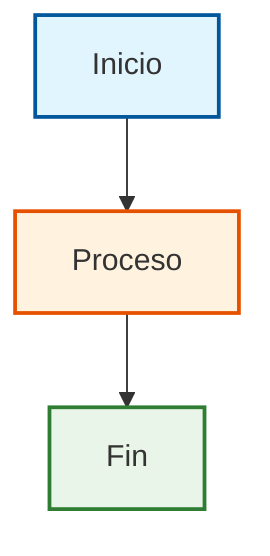

# Ejemplos Completos de Diagramas Mermaid

Esta guía presenta ejemplos detallados de diferentes tipos de diagramas que puedes crear usando el componente Mermaid.

## Diagramas de Flujo (Flowcharts)

### Ejemplo 1: Proceso de Desarrollo de Software

````markdown

````

**Resultado:**


### Ejemplo 2: Sistema de Autenticación

````markdown

````

**Resultado:**


## Diagramas de Secuencia

### Ejemplo 3: API REST - Proceso de Compra

````markdown

````

**Resultado:**


## Diagramas de Clases

### Ejemplo 4: Sistema de Gestión de Biblioteca

````markdown
```mermaid
classDiagram
    class Usuario {
        -id: String
        -nombre: String
        -email: String
        -fechaRegistro: Date
        +login()
        +logout()
        +buscarLibro()
    }
    
    class Libro {
        -isbn: String
        -titulo: String
        -autor: String
        -fechaPublicacion: Date
        -disponible: Boolean
        +prestar()
        +devolver()
        +obtenerInfo()
    }
    
    class Prestamo {
        -id: String
        -fechaPrestamo: Date
        -fechaDevolucion: Date
        -estado: String
        +crear()
        +finalizar()
        +extender()
    }
    
    class Biblioteca {
        -nombre: String
        -direccion: String
        +agregarLibro()
        +eliminarLibro()
        +buscarLibro()
        +generarReporte()
    }
    
    Usuario ||--o{ Prestamo : realiza
    Libro ||--o{ Prestamo : incluye
    Biblioteca ||--o{ Libro : contiene
    Biblioteca ||--o{ Usuario : registra
```
````

**Resultado:**
```mermaid
classDiagram
    class Usuario {
        -id: String
        -nombre: String
        -email: String
        -fechaRegistro: Date
        +login()
        +logout()
        +buscarLibro()
    }
    
    class Libro {
        -isbn: String
        -titulo: String
        -autor: String
        -fechaPublicacion: Date
        -disponible: Boolean
        +prestar()
        +devolver()
        +obtenerInfo()
    }
    
    class Prestamo {
        -id: String
        -fechaPrestamo: Date
        -fechaDevolucion: Date
        -estado: String
        +crear()
        +finalizar()
        +extender()
    }
    
    class Biblioteca {
        -nombre: String
        -direccion: String
        +agregarLibro()
        +eliminarLibro()
        +buscarLibro()
        +generarReporte()
    }
    
    Usuario ||--o{ Prestamo : realiza
    Libro ||--o{ Prestamo : incluye
    Biblioteca ||--o{ Libro : contiene
    Biblioteca ||--o{ Usuario : registra
```

## Diagramas de Estado

### Ejemplo 5: Estados de una Orden de Compra

````markdown

````

**Resultado:**


## Diagramas de Entidad-Relación

### Ejemplo 6: Base de Datos de E-commerce

````markdown

````

**Resultado:**


## Diagramas de Gantt

### Ejemplo 7: Cronograma de Proyecto

````markdown

````

**Resultado:**


## Consejos para Usar Mermaid

### Mejores Prácticas

1. **Mantén la simplicidad**: No sobrecargues los diagramas con demasiada información
2. **Usa colores consistentes**: Define un esquema de colores y manténlo
3. **Etiquetas claras**: Usa nombres descriptivos para nodos y relaciones
4. **Documentación**: Siempre incluye una breve explicación del diagrama

### Personalización con Estilos

Puedes personalizar la apariencia de tus diagramas:

````markdown

````

**Resultado:**


## Recursos Adicionales

- [Documentación oficial de Mermaid](https://mermaid.js.org/)
- [Editor en línea de Mermaid](https://mermaid.live/)
- [Galería de ejemplos](https://mermaid.js.org/syntax/examples.html)

¡Experimenta con diferentes tipos de diagramas para encontrar el que mejor se adapte a tus necesidades de documentación!